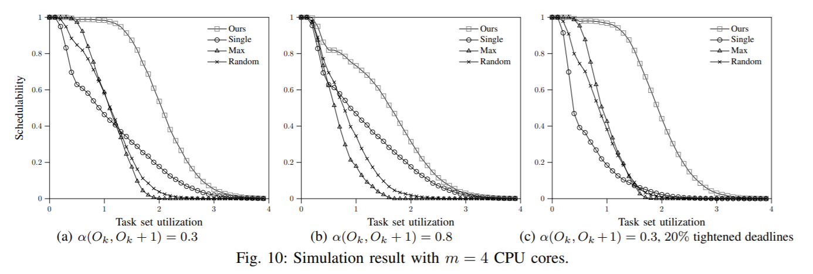
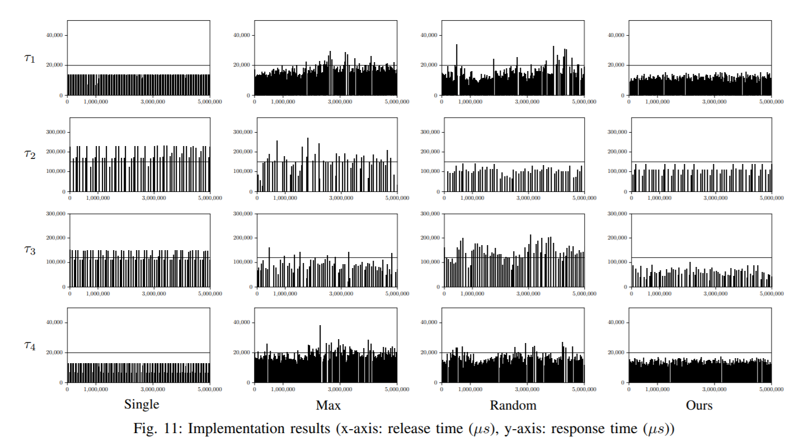
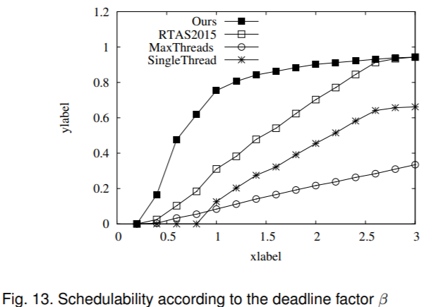
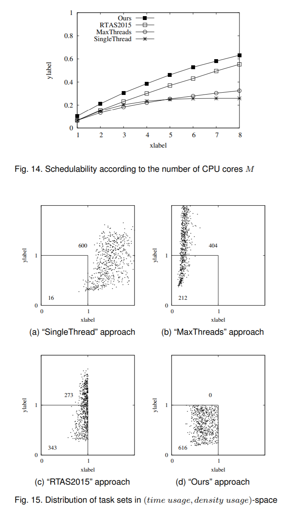
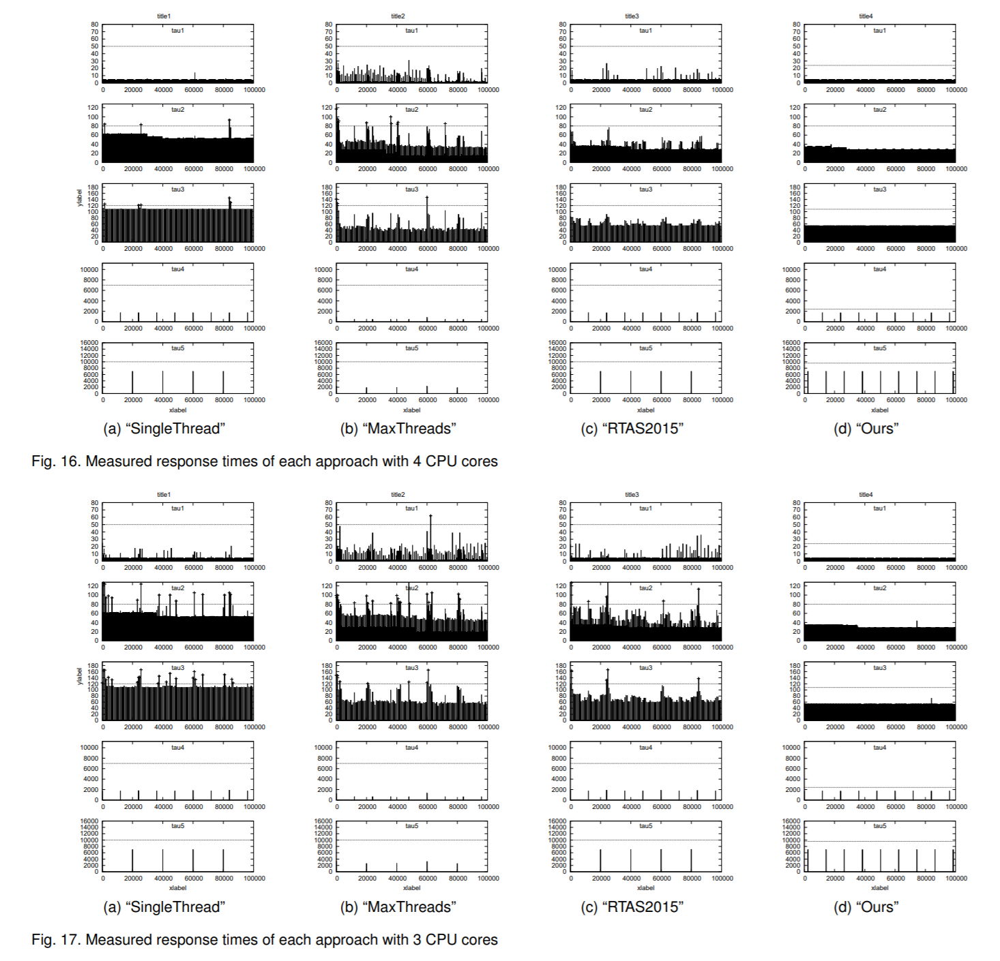
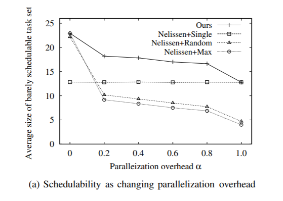
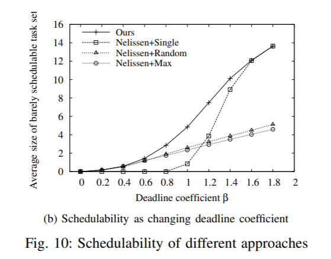
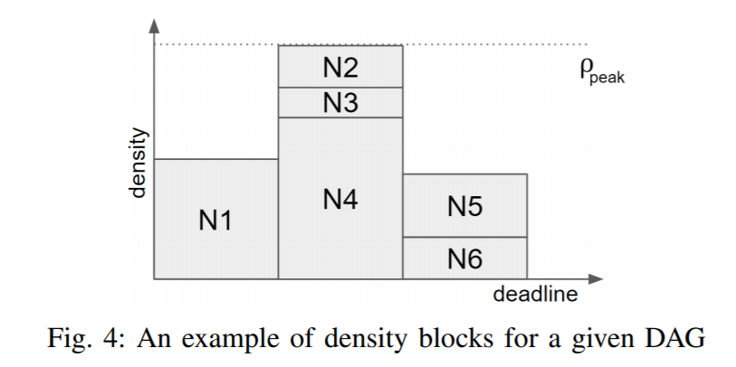
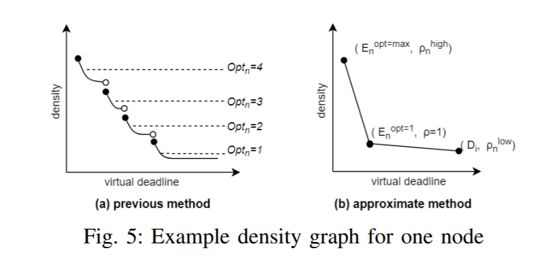
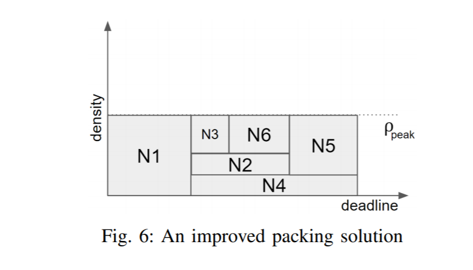

<h3 class="text-center">Multi-core Scheduling</h3>

Youngeun Cho, Do Hyung Kim, Daechul Park, Seungsu Lee, and Chang-Gun Lee, Conditionally Optimal Task Parallelization for Global EDF on Multi-core Systems, in IEEE Real-Time Systems Symposium (RTSS), Dec. 2019.

Targeting global EDF scheduling, this paper proposes a conditionally optimal algorithm for parallelizing tasks with parallelization freedom. For this, we extend the interferencebased sufficient schedulability analysis and derive monotonic increasing properties of both tolerance and interference for the schedulability. Leveraging those properties, we propose a oneway search based conditionally optimal algorithm with polynomial time complexity. Our extensive experiments through both simulation and actual implementation show that our proposed approach can significantly improve the schedulability up to 60 percent.

Kang-Wook Kim, Youngeun Cho, Jeongyoon Eo, Chang-Gun Lee, and Junghee Han, System-wide Time vs. Density Tradeoff in Real-Time Multicore Fluid Scheduling, in IEEE Transactions on Computers (TC), Vol. 67, Issue 7, pp. 7, July 2018.

Recent parallel programming frameworks such as OpenCL and OpenMP allow us to enjoy the parallelization freedom for real-time tasks. The parallelization freedom creates the time vs. density tradeoff problem in fluid scheduling, i.e., more parallelization reduces thread execution times but increases the density. By system-widely exercising this tradeoff, we propose optimal parameter tuning of real-time tasks aiming at maximizing the schedulability of multicore fluid scheduling. Our experimental study by both simulation and actual implementation shows that the proposed approach well balances the time and the density, and results in up to 80% improvement of the schedulability.

  

  

Jihye Kwon, Kang-Wook Kim, Sangyoun Paik, Jihwa Lee, and Chang-Gun Lee, Multicore Scheduling of Parallel Real-Time Tasks with Multiple Parallelization Options, in 21st IEEE Real-Time and Embedded Technology and Applications Symposium (RTAS), Seattle, Washington, Apr. 2015.

Past researches on multicore scheduling assume that a computational unit has already been parallelized into a prefixed number of threads. However, with recent technologies such as OpenCL, a computational unit can be parallelized in many different ways with runtime selectable numbers of threads.This paper proposes an optimal algorithm for parallelizing and scheduling a set of parallel tasks with multiple parallelization options on multiple CPU cores. The proposed algorithm is validated through both simulation and actual implementation. To the best of our knowledge, this is the first work addressing the problem of scheduling real-time tasks with multiple parallelization options on multiple CPU cores.

 

 

Kang-Wook Kim, Jeongyoon Eo, and Chang-Gun Lee, A Problem of Time vs. Density Tradeoff in Multicore Fluid Scheduling, in Real-Time Scheduling Open Problems Seminar, Dubrovnik, Croatia, June 2017.

Wonjae Jang, Jihwa Lee, and Chang-Gun Lee, Improving Schedulability for Periodic Task under GEDF Test Using Parallelization,  in Korea Computer Congress 2017 (KCC 2017), Jeju, June 2017.

Youngeun Cho and Chang-Gun Lee, Response Time Analysis Based Schedulability Test for Global EDF with Parallelization Options, in Korea Computer Congress 2016(KCC 2016), Jeju, June 2016.

Sangyoun Paik, Kang-Wook Kim, Jihwa Lee, and Chang-Gun Lee, Design of Parameter Decision Genetic Algorithm for Multi-parameter Real-time Task Scheduling in Multiplecore System, in KIISE 42nd Winter Conference, Pyeongchang, Dec. 2015.

Hyejin Joo and Chang-Gun Lee, Efficient Kernel Scheduling Technique for CGRA-based Multi-Core Architecture, in Korea Computer Congress 2015(KCC 2015), Jeju, Korea, June 2015.

<h3 class="text-center">Direct Acyclic Graph Tasks Schedule</h3>

Johnathon Soulis, Jaewoo Lee, and Chang-Gun Lee, Handling Intra-Task Parallelism for Real-Time DAG Tasks Scheduled on Multiple Cores, in WiP -- 30th Euromicro Conference on Real-Time Systems (ECRTS18), Barcelona, Spain, July 2018.

In this paper, we discuss a method for scheduling a set of parallel tasks modeled by a generic DAG task model. We present a method that handles the intra-task parallelism between computational units as well as the parallelization of individual computational units in order to schedule the tasks on multiple CPU cores. We introduce a density packing problem that describes our approach for handling intra-task parallelism in order to minimize the overall task minimum peak density.

<h3 class="text-center">GPGPU Scheduling</h3>

Chan-Hee Choi, Kang-Wook Kim, and Chang-Gun Lee, Multiple GPGPUs Response Time Measurement and Simulation for Real-time Systems, in KIISE 43rd Winter Conference, Pyeongchang, Dec. 2016.

Chan-Hee Choi, Alchan Kim, Kang-Wook Kim, and Chang-Gun Lee, Multiple GPU Scheduling for Real-time Systems, in KIISE 42nd Winter Conference, Pyeongchang, Dec. 2015.

<h3 class="text-center">ETC</h3>

Kang-Wook Kim, Myung-Gon Park, Junghee Han, and Chang-Gun Lee, A Holistic Approach to Optimizing the Lifetime of IEEE 802.15.4/ZigBee Networks with a Deterministic Guarantee of Real-Time Flows, in Journal of Computing Science and Engineering, Vol. 9, No. 2, June 2015.

Victoria Shangina, Kyoung-Soo We, and Chang-Gun Lee, Executing Real-Time Programs on negative-AND Flash Memory Considering Read Disturb Errors, in 2017 3rd IEEE International Conference on Computer and Communications (ICCC), Chengdu, China, Dec. 2017.

Artem Burmyakov, Enrico Bini, and Eduardo Tovar, An Exact Schedulability Test for Global FP Using State Space Pruning, in 23rd International Conference on Real-Time Networks and Systems (RTNS 2015), Lille, France, Nov. 2015.

Seungsu Lee, Daechul Park, Youngeun Cho, and Chang-Gun Lee, Necessary Bound of Resource Utilization for Fail-Safe Execution of ROS Task, in KCC 2019, Jeju, June 2019.

Do Hyung Kim, Alena Kazakova, Youngeun Cho, and and Chang-Gun Lee, Introducing New Features for OSCAR, Introducing New Features for OSCAR, in KSC 2018 Winter, Pyeongchang, Dec. 2018.

Alena Kazakova, Youngeun Cho, and Chang-Gun Lee, OSCAR: An Open-Source, Self-Driving CAR Testbed, OSCAR: An Open-Source, Self-Driving CAR Testbed, in KCC 2018 Summer, June 2018.

Nushaba Gadimli, Wee Kyoung-Soo, Chang-Gun Lee, and , Execution of Soft Real-time Program on NAND Flash Memory with Guaranteed Reliability, in WDCS2017: Workshop on Dependable Computing System Jeju, August 2017, Korea.

Victoria Shangina and Chang-Gun Lee, Executing Real-Time Programs on NAND Flash Memory Considering Read Disturb Errors​, in Korea Computer Congress 2017 (KCC 2017), Jeju, June 2017.

Youngeun Cho, Jihwa Lee, and Chang-Gun Lee, An Improved Workload-Bound Global EDF Schedulability Test,in KIISE 42nd Winter Conference, Pyeongchang, Dec. 2015.

Jihwa Lee, Kang-Wook Kim, Sangyoun Paik, and Chang-Gun Lee, Global EDF Scheduling for Periodic Task Model with Parallelization Options, in KIISE 2015, Pyeongchang, Dec. 2015.

Hyejin Joo, Kyoung-Soo We, and Chang-Gun Lee, Analysis of the Idle State of a Processor for verifying in Real-Time Systems, in KIISE 42nd Winter Conference, Pyeongchang, Gangwon-do, Dec. 2015.

Seunggon Kim, Kyoung-Soo We, and Chang-Gun Lee, HW timer-based Event-driven Scheduler on Embedded System, in Korea Computer Congress 2015, Jeju, June 2015.

